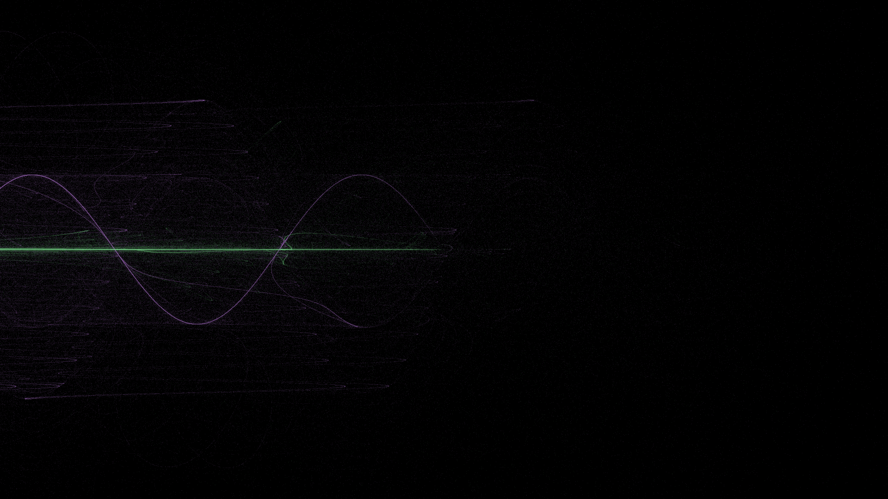
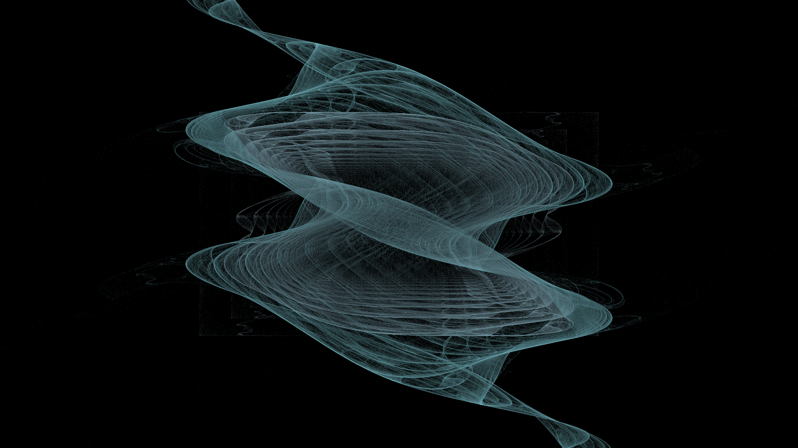
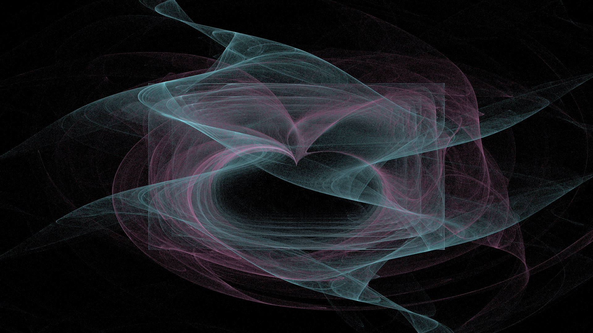
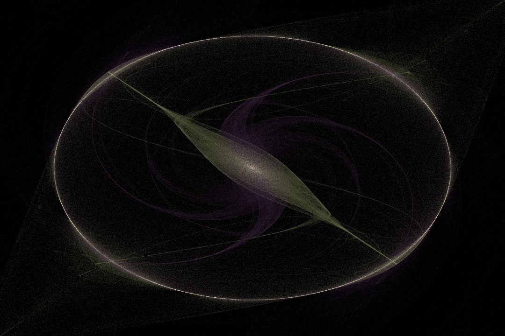
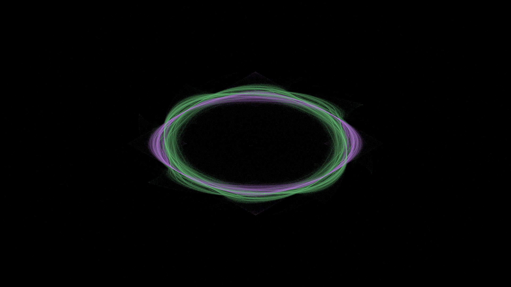
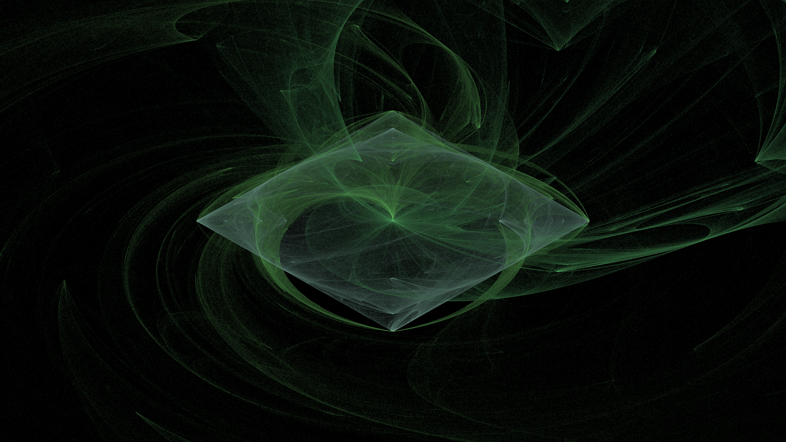
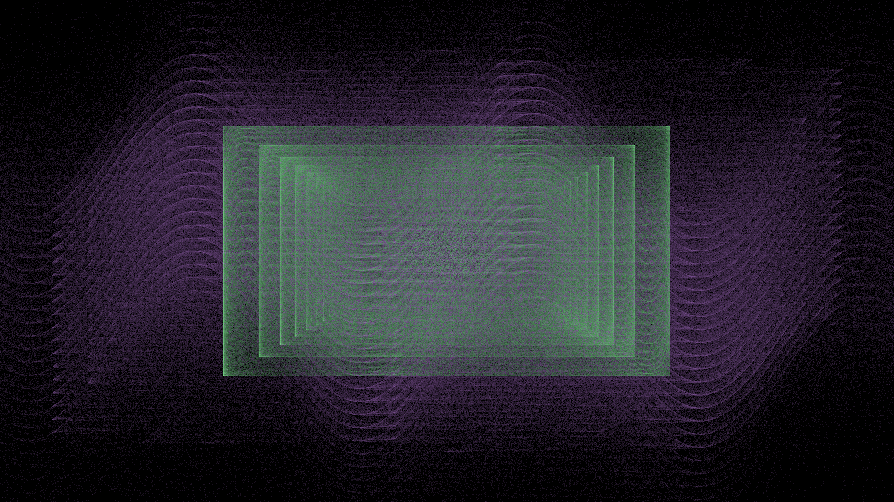

# 🌀 Fractal Flame Generator

**Fractal Flame Generator** — это приложение для создания красивых и уникальных фрактальных изображений с поддержкой настройки параметров, многопоточной генерации и сохранения в популярных графических форматах.

---

## 📌 Описание

Это программное обеспечение позволяет генерировать **фракталы по алгоритму Flame**, используя различные **аффинные преобразования** и нелинейные вариации. Подходит как для любителей математического искусства, так и для разработчиков, желающих поэкспериментировать с фракталами.

---

## 🛠️ Возможности

✅ Генерация фрактальных изображений по заданным параметрам  
✅ Добавление пользовательских аффинных преобразований  
✅ Многопоточная обработка для ускорения вычислений  
✅ Сохранение изображений в форматах: PNG, JPEG, BMP, GIF  
✅ Простой и понятный интерфейс управления  

---

## 🧪 Как использовать

1. 🔹 Запустите приложение.
2. 🔹 Укажите параметры:
   - Ширина / Высота изображения
   - Количество образцов
   - Итераций на образец
   - Симметрия (от 1 до 10)
   - Режим выполнения: однопоточный или многопоточный
   - Количество потоков (для многопоточного режима)
3. 🔹 Добавьте нужные аффинные преобразования через кнопку **"Add Transformation"**
4. 🔹 Удалите ненужные преобразования через **"Remove Transformation"**
5. 🔹 Нажмите **"Generate Fractal"**, чтобы создать изображение.
6. 🔹 Сохраните результат через **"Save Fractal"** в нужном формате.
7. 🔹 Завершите работу с приложением через **"Exit"**

---

## 🎨 Примеры фракталов

Ниже представлены несколько примеров фракталов, которые можно сгенерировать с помощью этого приложения:

| Пример 1 | Пример 2 | Пример 3 |
|----------|----------|----------|
|  |  |  |

| Пример 4 | Пример 5 | Пример 6 |
|----------|----------|----------|
|  |  |  |

| Пример 7 |
|----------|
|  |

---

## 🚀 Технические детали

- **Поддержка многопоточности**: Используйте все ядра процессора для ускорения генерации.
- **Гибкая настройка**: Настройте точность рендеринга и сложность фрактала под свои цели.
- **Кастомизация преобразований**: Экспериментируйте с различными функциями отображения.

---

## 💬 Вдохновение

Фракталы типа Flame были впервые предложены Скоттом Дрейверсом и Рональдом Ротенбергом. Они известны своими органичными, дымообразными формами и широко используются в цифровом искусстве.

---

## 🙌 Благодарность
Спасибо за использование! Если у вас есть идеи по улучшению приложения — создайте issue или отправьте pull request.
